## 유기견 타워 디펜스 : DogTowerDefense
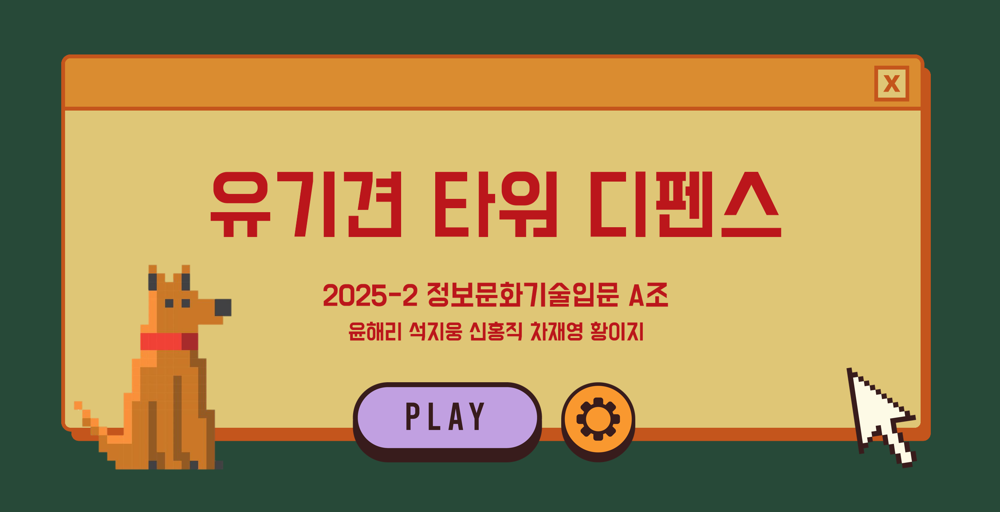

"길 위의 강아지를 손끝으로 만나 기억할 수 있도록"

매년 수만 마리의 유기견들이 보호소에서 안락사를 기다리거나, 거리에서 보이지 않는 죽음을 맞이합니다.
우리는 이 이야기가 뉴스 속 짧은 소비로 끝나지 않기를 바랐습니다.  
유기견의 생명을 구하는 경험을 통해, 플레이어가 이 문제에 직접 개입하고 기억하도록 하는 게임을 기획했습니다.
DogTowerDefense는 뉴스로만 소비되던 유기견 문제를 ‘행동과 돌봄’의 이야기로 바꾸고자 합니다.

## 프로젝트 개요
### 타워 디펜스 게임이란?
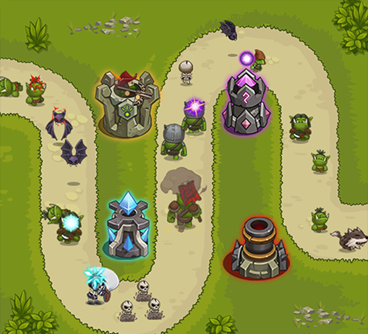
- 정해진 경로로 이동하는 적을 막기 위해 다양한 공격 타워를 배치하고 업그레이드하는 전략 게임
### DogTowerDefense의 차별점
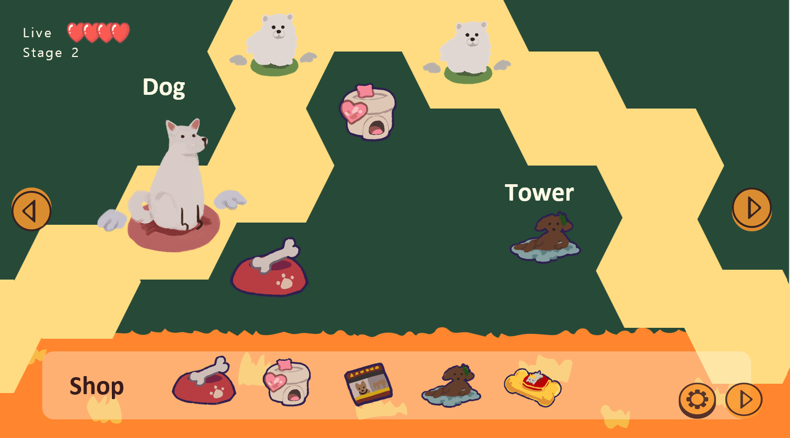
- 적 → 버림받고 상처받은 강아지들
- 막기 위해 → 치유와 회복을 위해
- 다양한 공격 타워 → 다양한 돌봄 타워

즉, DogTowerDefense는 " 정해진 경로로 이동하는 버림받고 상처받은 강아지들의 치유와 회복을 위해 다양한 돌봄 타워를 배치하고 업그레이드하는 게임 "이라고 정의할 수 있다.

유기견들이 경로 끝까지 도착하기 전에 유기견의 체력을 회복한 후 구조에 성공하는 것이 게임의 목표로 삼는다.

## 코드 구조
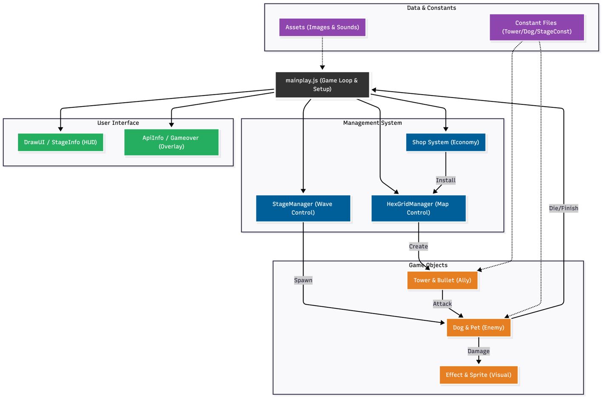
이미지, 사운드 등의 asset 파일과 게임에 사용되는 각종 데이터 및 상수 값은 preload 단계에서 외부로부터 미리 로드된다. 이를 통해 게임 실행 중 발생할 수 있는 로딩 지연을 최소화하고, 안정적인 게임 루프를 유지한다.

게임의 핵심 로직은 화면에 직접 드러나지 않는 Management System에서 담당한다.
StageManager, HexGridManager, Shop System은 각각 웨이브 진행 관리, 맵 및 타워 배치 제어, 경제 시스템 및 설치 로직을 담당하며, 백엔드처럼 뒤에서 게임의 전체 흐름과 상태를 제어하는 역할을 수행한다.

실제 게임 내에서 동작하는 객체들은 Tower, Dog, Pet, Bullet, Effect와 같은 Game Object 클래스로 구성되어 있다. 이 객체들은 Management System에 의해 생성·관리되며, 공격, 피해 처리, 소멸 등의 상호작용 로직을 내부적으로 포함한다.

UI는 DrawUI, DrawStageInfo, ApiInfo, GameOver 등의 전용 UI 함수와 각 게임 객체의 show() 메서드를 통해 구현된다. 이를 통해 게임 로직과 화면 렌더링 로직을 분리하여 가독성과 유지보수성을 높였다.

이러한 다양한 시스템과 객체들은 mainplay.js를 중심으로 통합된다.
mainplay.js는 메인 게임 루프를 포함하며, 게임 상태에 따른 조건문을 통해 각 시스템과 객체를 순차적으로 호출·관리하는 중앙 컨트롤러 역할을 수행한다.

## main component : Dog
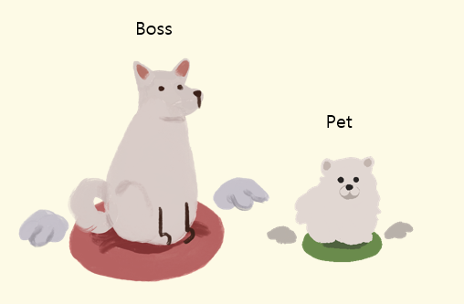

### Dog : 경로를 이동하며 치유되는 메인 캐릭터 
- Boss: 1마리, 높은 HP, 늦은 속도, 큰 보상
- Pet: 다수 등장, 낮은 HP, 빠른 속도
- 효과 표시 (❄️, ⚡), 상태별 이미지 (sad, happy)
- 공유하는 로직은 있지만, boss/pet 다른 클래스로 분리해서 관리
- Stagemanager.js에서 스테이지 마다 pet/boss count 다르게 설정 및 처리
- Boss 종류

  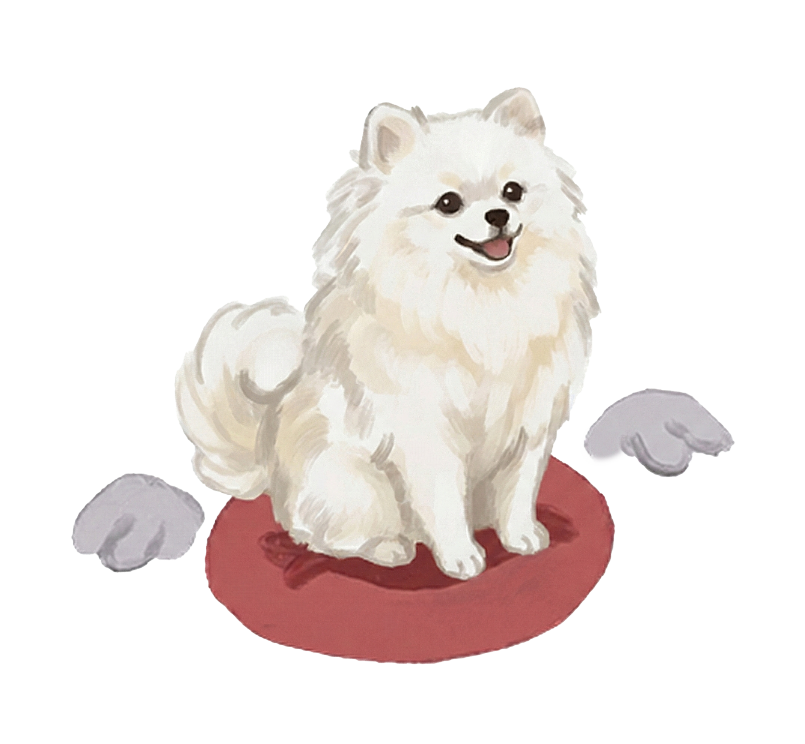
  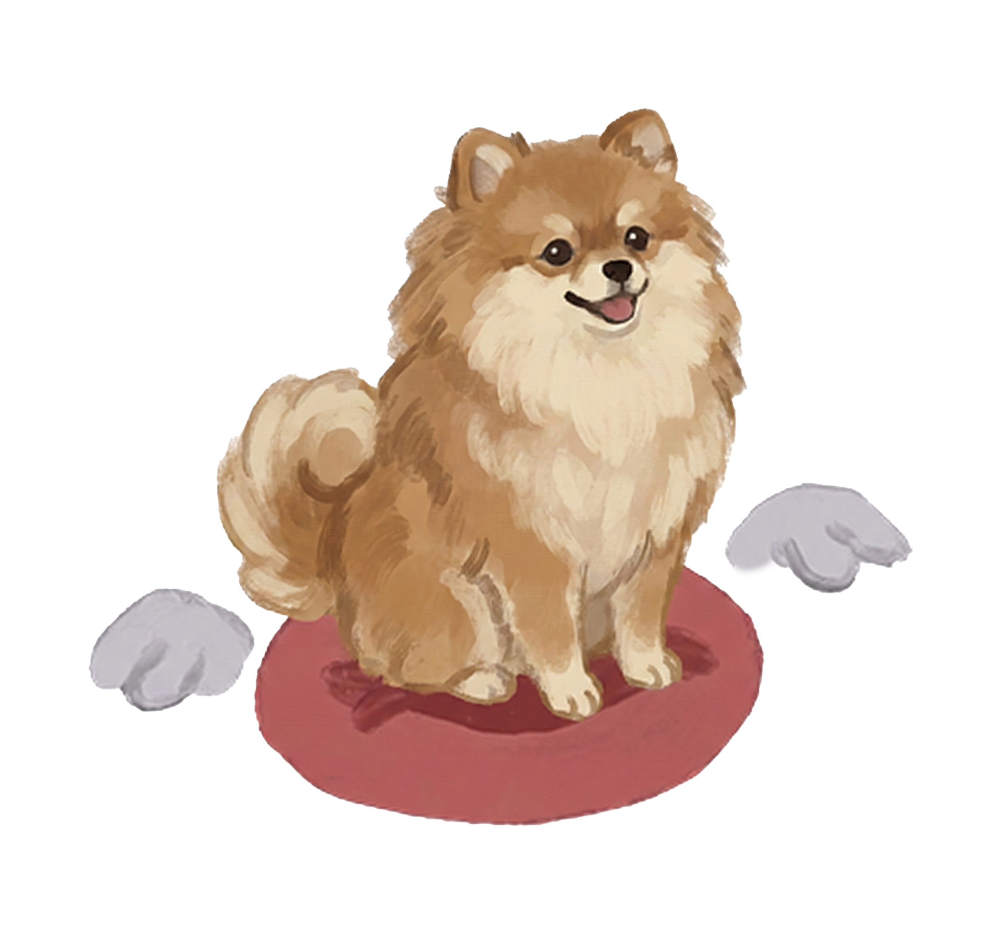
  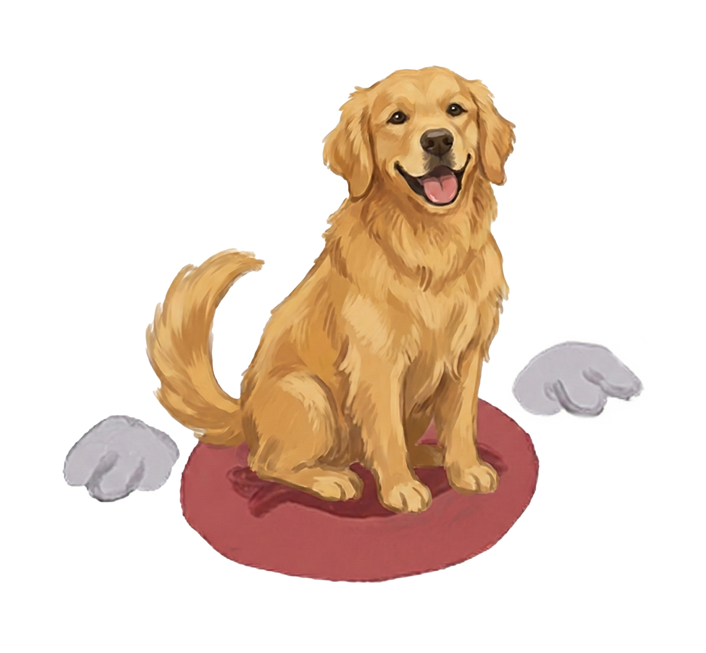

  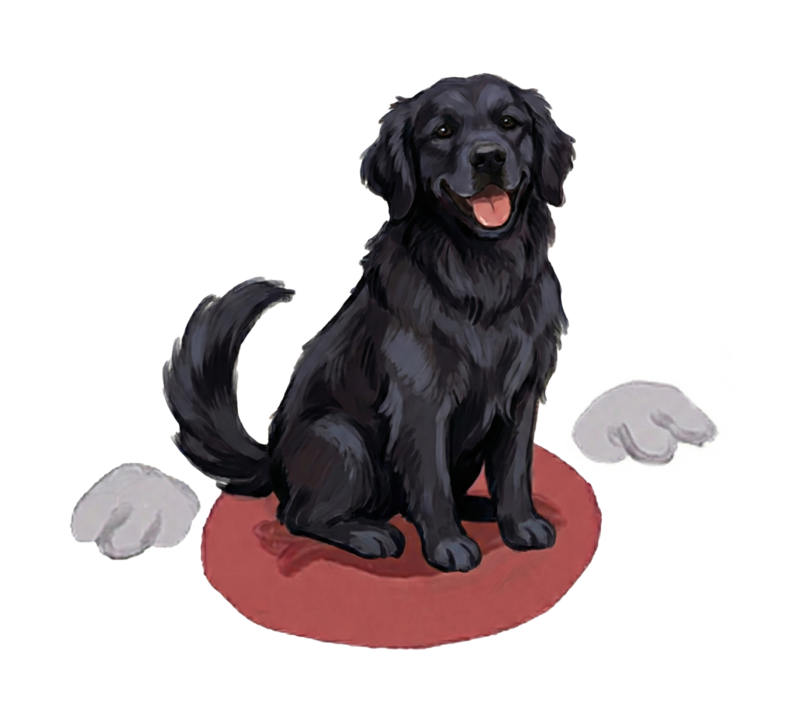
  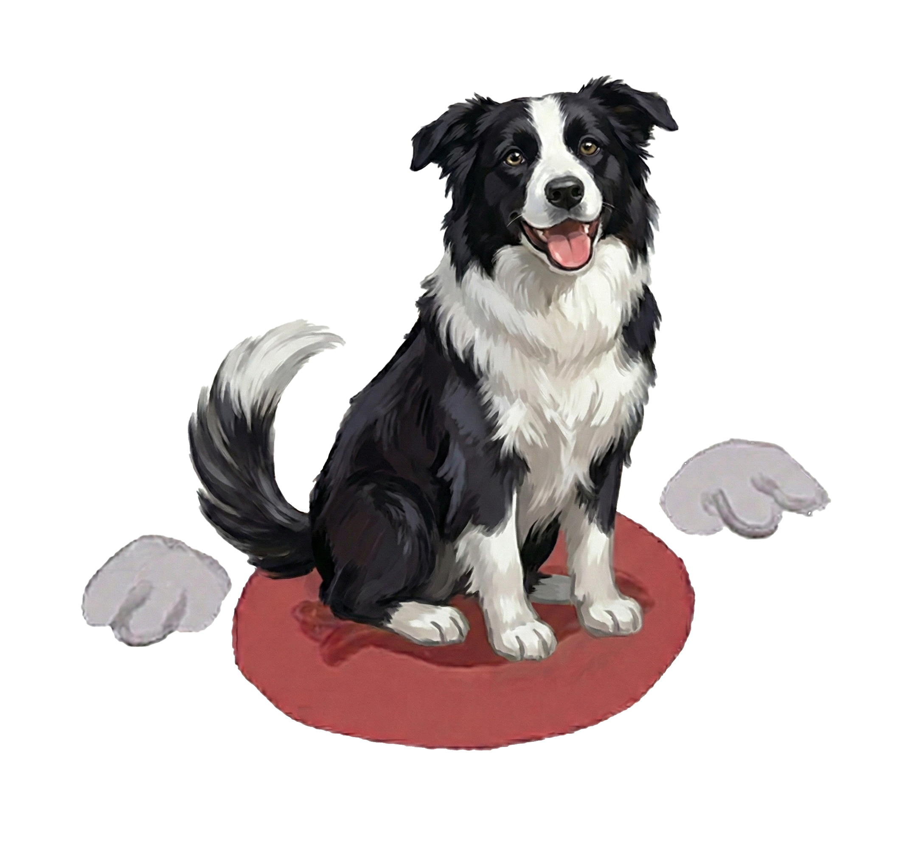
  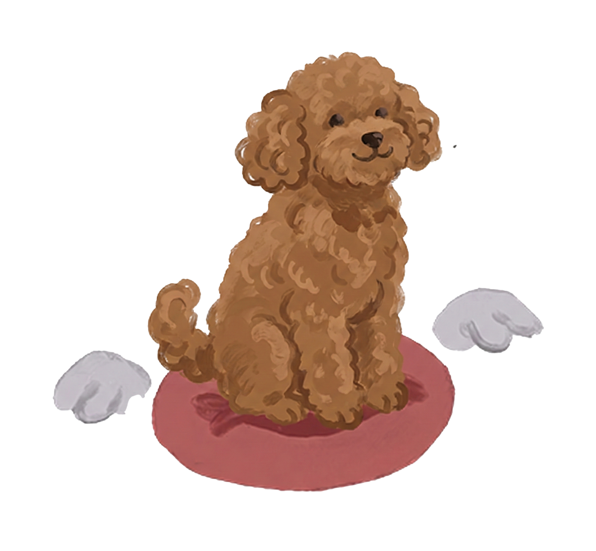

### HP
- 0에서 시작해 힐을 받을수록 HP 증가
- maxHP 도달하면 제거
    - 유기견 ‘돌봄’의 컨셉 구현하고자 '공격'을 '치유'로, '제거'를 '구조'로 시스템 설계

## main component : Tower
### Tower : 강아지들을 감지하고 힐을 발사하는 치유 장치
- 안정, 집중케어, 강아지를 찾습니다, 놀이터, 푸들 요정의 가호, 황금 뼈다귀 사원  등 스토리라인에 맞는 9종 구성
- 슬로우, 재화, 버프 타워 등 기존 타워 디펜스 게임 레퍼런스 참고
- 스테이지 별 오픈 가능한 타워 제한
- 사거리 내 가장 가까운 dog 1마리 타겟
- 레벨 기반 성장 (사거리, 속도, 힐의 양 증가)
- 경로 내 설치 가능 타워와 경로 밖 설치 가능 타워 구분
- 클릭 시 업그레이드 / 삭제 결정 가능
- Tower 종류

  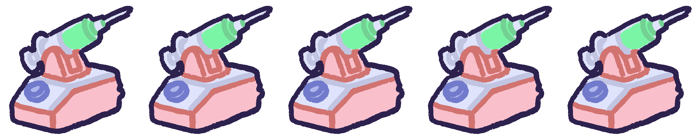
  
  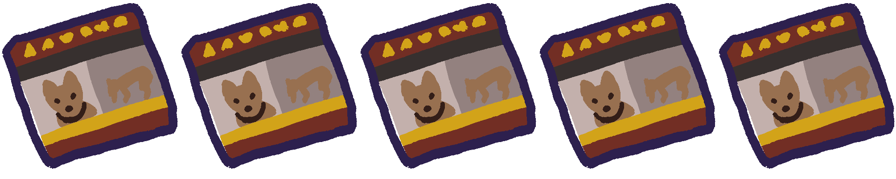

  
  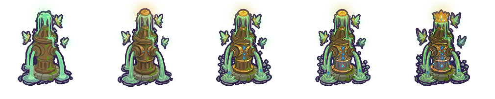
  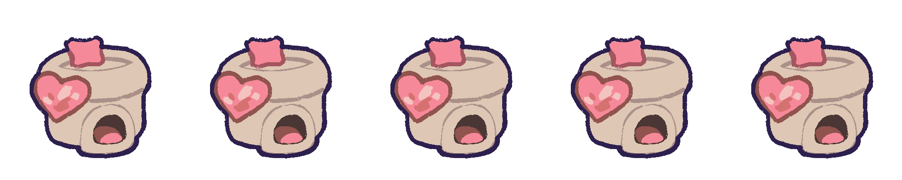

  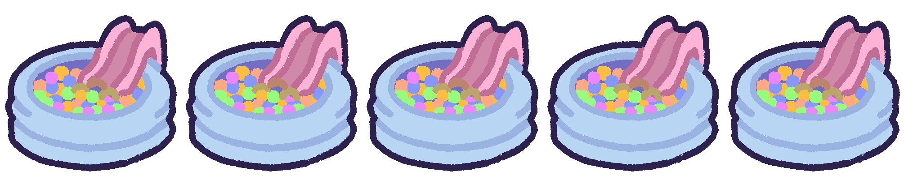
  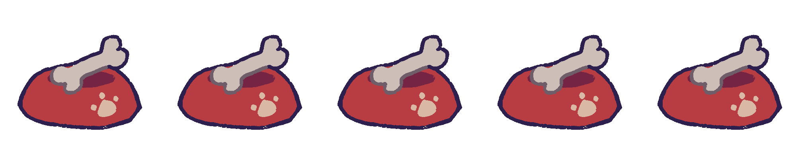
  

### 관련 Class
- tower.js 속성결정 (속도, 데미지 계산)
- bullet.js 충돌로직 및 이펙트 (관통, 스플래시) 
- pet.js slow, play 관리
- shop.js 상점 인터페이스 출력 및 해금타워 관리

## main component : 유기동물 정보창

### 유기동물 정보창
- 현실에서 도움을 필요로 하는 유기견 정보 제공

### API 정보
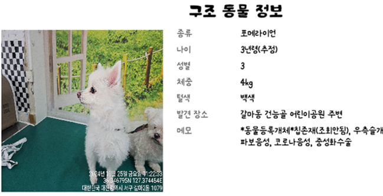
- 대전 유기동물공고 오픈 API 연결
- 스테이지 엔딩 이후 이미지, 종, 나이, 성별 등의 구체적인 데이터를 카드형 정보 화면으로 시각화
- 실제 구조된 동물 정보를 유저들에게 제공 → 게임을 넘어 ‘현실’의 문제를 인지하게 유도, 실제로도 도움을 제공할 수 있다는 효능감 전달

1. Image Data Handling Strategy

API에서 제공되는 이미지 리소스는 직접 서버를 통해 접근할 수 없는 구조였기 때문에, 초기 구현 단계에서는 API로부터 전달받은 메타데이터를 기반으로 개별 이미지를 자동으로 로컬에 다운로드하는 스크립트를 작성하였다. 이를 통해 게임 내에서 필요한 이미지들을 안정적으로 불러올 수 있었다.

그러나 이 방식은 프로젝트가 확장될수록 프로그램 전체 용량이 과도하게 증가하는 문제를 야기하였다.
이에 대한 개선 방향으로, p5.js 환경에서 접근 가능한 클라우드 형태의 이미지 서버에 리소스를 저장하고, 실행 시점에 필요한 이미지를 동적으로 불러오는 구조로 리팩토링을 계획하였다. 해당 방식은 현재 설계 단계에 있으며, 추후 구현을 통해 프로젝트에 적용할 예정이다.

2. Character Design & API Data Mapping

본 프로젝트는 스테이지별로 등장하는 유기견 캐릭터의 외형과, 팝업을 통해 제공되는 실제 유기견 정보 간의 연결성을 강조하고자 하였다.
이를 위해 각 스테이지에 등장하는 캐릭터 외형에 시각적 특징을 태그 형태로 정의하고, API의 item별 데이터에 해당 외형 묘사가 포함되어 있을 경우, 그와 가장 유사한 실제 유기견 정보를 매칭하여 출력하도록 설계하였다.

다만, API 내부의 외형 묘사 텍스트가 일관된 형식을 갖추고 있지 않아, 이를 파싱하기 위한 태그 기준을 설정하는 과정에서 많은 시행착오가 있었다. 이 과정에서 태그의 범위와 우선순위를 조정하며, 최대한 안정적인 매칭 결과를 도출하고자 하였다.

3. Information Delivery & Narrative Design

‘게임’이라는 매체의 특성상, 이용자가 스테이지 진행에 집중한 나머지 API를 통해 제공되는 실제 유기견 정보를 충분히 인지하지 못할 가능성에 대한 우려가 있었다. 실제 플레이 테스트 과정에서도,
“스테이지 클리어와 실제 유기견 정보를 제공하는 팝업 간의 관계가 명확하지 않다”는 피드백이 확인되었다.

이를 개선하기 위해, 스테이지 클리어 정보와 실제 유기견 정보를 제공하는 팝업을 시간적으로 분리하여 각각 독립적인 흐름으로 제시하였다. 이를 통해 이용자가 API 기반 정보가 제공되는 상황임을 명확히 인식하도록 유도하고자 했다.

또한, 단순히 API에서 제공되는 label과 value를 그대로 출력하는 방식에서 벗어나, 추가적인 설명과 서사를 덧붙여 게임이 의도하는 메시지가 자연스럽게 전달되도록 구성하였다.
아울러, 실제 유기견 입양 절차 및 관련 정보를 확인할 수 있는 QR 코드를 삽입하여, 게임 외부의 행동으로 이어질 수 있는 상호작용을 강화하였다.

## 실제 플레이 화면
### 시작화면
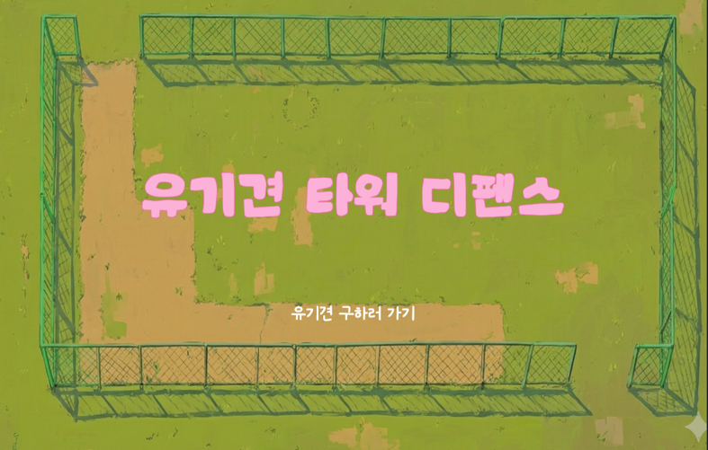
### 튜토리얼

  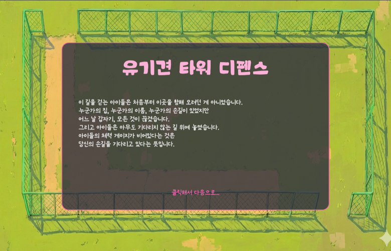
  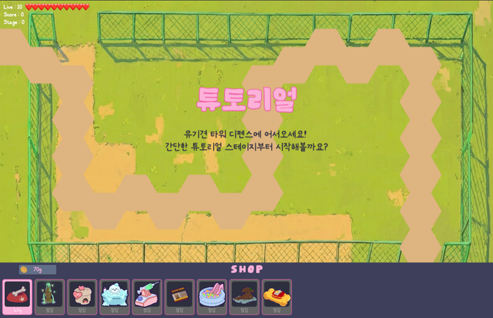

### 기본 타워 구성 및 업그레이드, 제거 화면
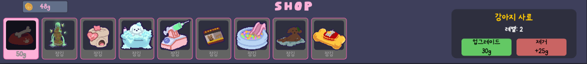

### 타워 해금 예시

### 플레이 예시 1
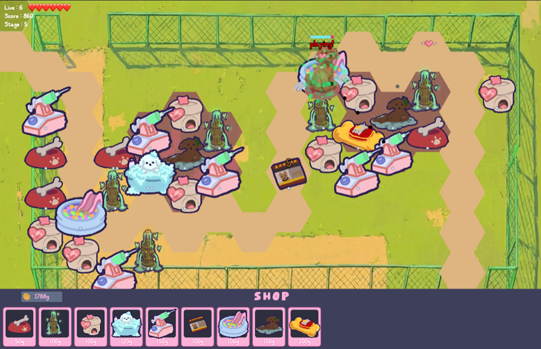

### 보스 등장 팝업창
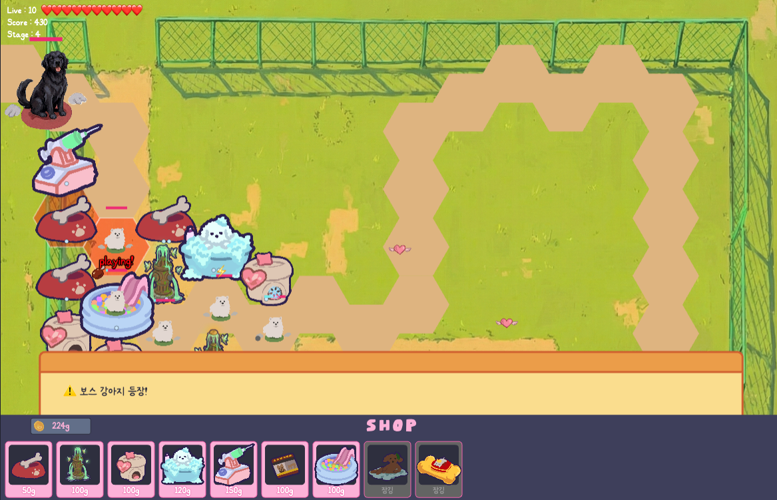

### 플레이 예시 2 : 코드 화면

  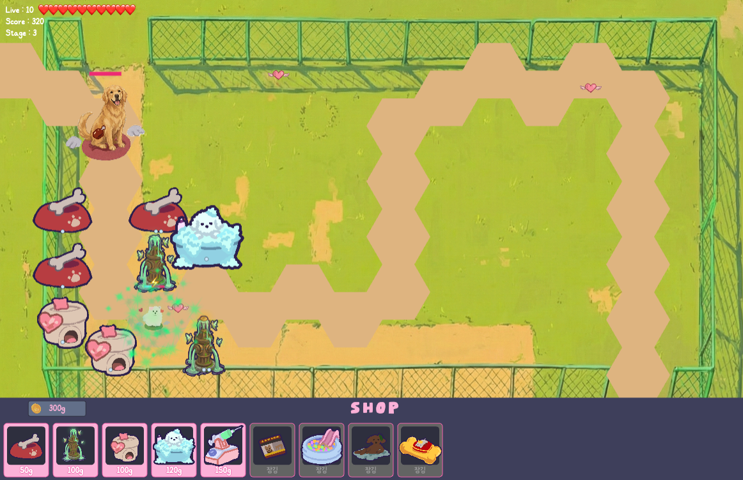
  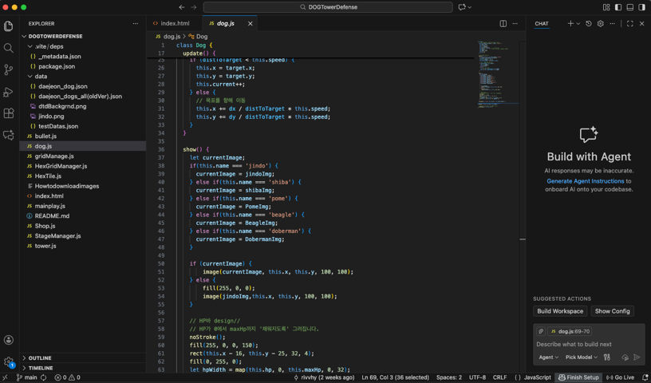

### 구조 실패 엔딩
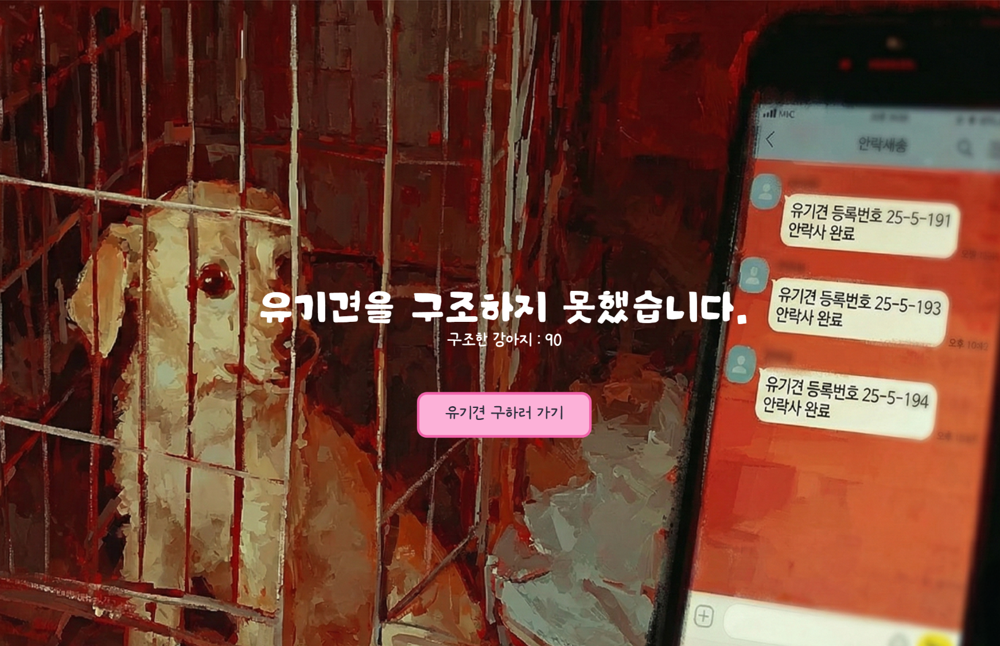